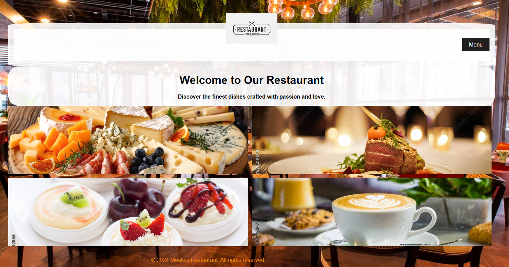

# Heading 1
## Heading 2
### Heading 3
paragraphs

line breaks
**Bold text**  

*italics*

***bold and italized***

>blockquote

>>blockquote

### unordered list
-soap
-sugar
-meat

### ordered list
1. toothpaste
2. soap
3. salt

### Shopping List
* Soap
* Sugar
+ Bread\

### header section
```html
<head>
    <meta charset="UTF-8">
    <meta name="viewport" content="width=device-width, initial-scale=1.0">
    <title>Application Form</title>
</head>
```

```python
print('hello, world')
```

---
***
___
```bash
git clone githunURL
```

[See my website](https://gitauwilly1.github.io/Meekys-Restaurant/) 

